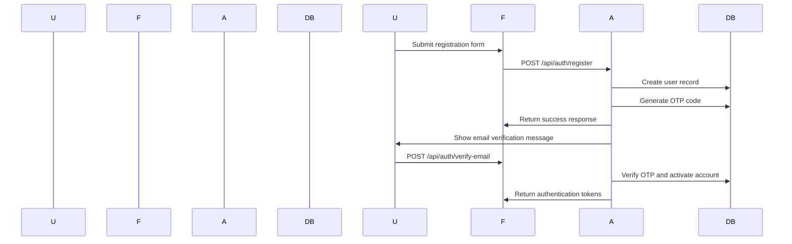
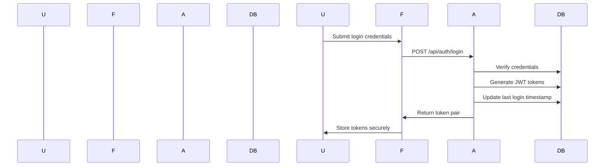
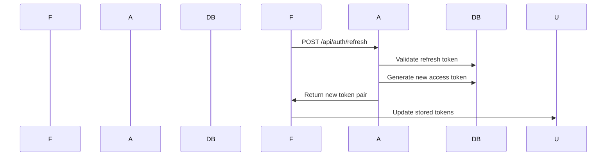
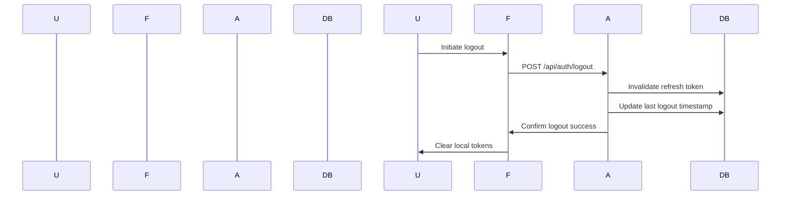

# KIU Admission Portal - Authentication & Security Documentation

## Overview

The KIU Admission Portal implements a comprehensive authentication and authorization system designed specifically for Kampala International University's security requirements and user management needs.

## Authentication Flow

### 1. User Registration



**Registration Process:**
1. User submits registration form with personal details
2. API validates input and creates user account
3. System generates 6-digit OTP code
4. OTP sent to user's email
5. User verifies OTP via email link or code entry
6. Account activated and authentication tokens issued

### 2. User Login



**Login Process:**
1. User provides email and password
2. API validates against stored hash
3. JWT access token (15 min expiry) and refresh token (7 days) generated
4. Tokens returned to frontend for session management

### 3. Token Refresh



**Refresh Process:**
1. Frontend sends refresh token before access token expiry
2. API validates refresh token and user status
3. New access token generated (15 minutes expiry)
4. Old refresh token invalidated
5. New token pair returned

### 4. Logout



**Logout Process:**
1. User initiates logout
2. API invalidates all user tokens
3. Database updated with logout timestamp
4. Frontend clears stored tokens

## Security Features

### Password Security

**Bcrypt Hashing** with 12 salt rounds for secure password storage
**Password Requirements**: 8+ chars, mixed case, numbers, special chars

### JWT Token Security

**Token Structure** with 15-minute access and 7-day refresh tokens
**Token Storage** in localStorage with expiration checking

### OTP Security

**OTP Generation** with 6-digit codes and 10-minute expiry
**OTP Validation** with rate limiting (5 attempts/hour) and IP tracking

## Role-Based Access Control (RBAC)

### User Roles
| Role | Permissions | KIU Context |
|-------|-------------|-------------|
| **applicant** | Submit applications, upload documents, view own profile | Students applying to KIU |
| **finalist** | View opportunities, apply for jobs, manage profile | Current KIU students |
| **admin** | Manage all applications, view analytics, manage users, system settings | KIU administration staff |

### Permission Implementation
Role-based access control decorator with permission checking for admin endpoints.

## Session Management

### Session Configuration
Flask session with HTTPS-only, HTTP-only cookies, CSRF protection, 30-minute lifetime.

## API Security

### Rate Limiting
Standard rate limiting (100/hour) with enhanced limits for sensitive endpoints (10/minute for login).

### CORS Configuration
CORS setup for KIU domains with proper headers and credential support.

## Data Protection

### Input Validation
Comprehensive Pydantic validation with password strength requirements (8+ chars, mixed case, numbers, special chars).

### SQL Injection Prevention
Parameterized SQLAlchemy queries to prevent SQL injection attacks.

### XSS Prevention
React XSS prevention with input sanitization and safe rendering practices.

## Audit and Logging

### Security Event Logging
Dedicated security logger with file handler and structured logging format.

### Audit Trail
Comprehensive audit logging for all user actions and data changes.

## Compliance

### Data Privacy

- **PII Encryption**: Sensitive data encrypted at rest
- **Data Retention**: User data retained according to KIU policy
- **Right to Deletion**: Users can request data deletion
- **Consent Management**: Explicit consent for data processing

### NCHE Compliance

- **Student Verification**: UNEB results integration
- **Programme Accreditation**: NCHE-approved programmes only
- **Data Protection**: Uganda Data Protection Act compliance
- **Audit Requirements**: Complete audit trail for all actions

## Testing Security

### Security Testing Checklist
- Authentication bypass attempts
- SQL injection testing
- XSS vulnerability scanning
- CSRF token validation
- Rate limiting effectiveness
- Session hijacking prevention
- File upload security testing

### Penetration Testing

```bash
# Security testing tools
nmap -sS -sV localhost 5001
sqlmap -u "http://localhost:5001/api" --dbs=mysql
burpsuite --url="http://localhost:5001"
```

## Monitoring

### Security Metrics

Security monitoring dashboard with failed logins, successful logins, active sessions, suspicious activities, and blocked IPs.

### Alert System

Security alerts for brute force detection and unusual access patterns.

## Best Practices

### For Developers

1. **Never hardcode credentials** - Use environment variables
2. **Validate all inputs** - Server and client-side validation
3. **Use HTTPS everywhere** - No HTTP in production
4. **Implement proper logging** - Security events must be logged
5. **Regular security updates** - Keep dependencies updated
6. **Principle of least privilege** - Minimum required permissions

### For Users

1. **Use strong passwords** - Mix of character types
2. **Enable 2FA when available** - OTP verification
3. **Log out completely** - Close all browser tabs
4. **Monitor account activity** - Check login history
5. **Report suspicious activity** - Contact KIU ICT immediately

---

*Last Updated: January 2024*
