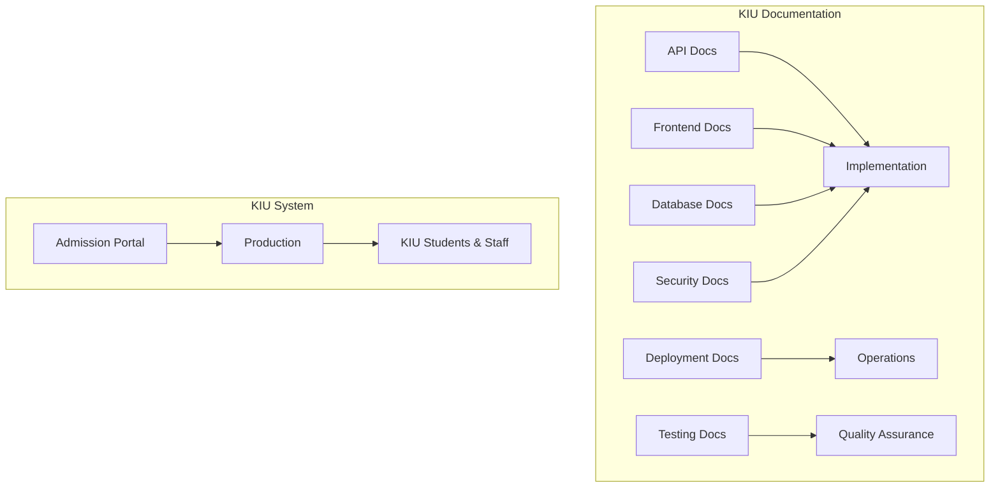

# KIU Admission Portal Documentation

## Overview

Welcome to the comprehensive documentation for the KIU Admission Portal - Kampala International University's digital admission and career placement platform.

## Documentation Structure

This documentation follows industry standards and provides complete coverage of all system components:

### 📚 Core Documentation

| Document | Purpose | Audience |
|-----------|---------|----------|
| **[API Documentation](./API.md)** | Complete REST API reference | Developers, Integrators |
| **[Frontend Documentation](./FRONTEND.md)** | React/TypeScript architecture | Frontend Developers |
| **[Database Documentation](./DATABASE.md)** | MySQL schema and design | Backend Developers, DBAs |
| **[Authentication & Security](./AUTHENTICATION.md)** | Security flows and best practices | Security Teams, Developers |
| **[Deployment & Operations](./DEPLOYMENT.md)** | Deployment and运维指南 | DevOps Engineers, System Admins |
| **[Testing & QA](./TESTING.md)** | Testing strategies and quality assurance | QA Teams, Developers |

### 🎯 Quick Start

1. **For Developers**: Start with [API Documentation](./API.md) to understand available endpoints
2. **For Frontend Development**: Review [Frontend Documentation](./FRONTEND.md) for component architecture
3. **For Database Management**: Consult [Database Documentation](./DATABASE.md) for schema details
4. **For Security Implementation**: Follow [Authentication & Security](./AUTHENTICATION.md) guidelines
5. **For Deployment**: Use [Deployment & Operations](./DEPLOYMENT.md) for environment setup
6. **For Testing**: Implement [Testing & QA](./TESTING.md) strategies

### 🏗 System Architecture

### 📋 Documentation Standards

This documentation adheres to industry standards:

#### **Technical Excellence**
- ✅ Comprehensive coverage of all system components
- ✅ Clear, actionable examples and code samples
- ✅ Consistent formatting and structure
- ✅ Version control and change tracking
- ✅ Cross-platform compatibility notes

#### **User Experience**
- ✅ Clear navigation and information hierarchy
- ✅ Multiple formats for different learning styles
- ✅ Quick reference guides and cheat sheets
- ✅ Searchable content with clear indexing
- ✅ Progressive disclosure of complexity

#### **Maintainability**
- ✅ Modular documentation structure
- ✅ Clear update procedures and versioning
- ✅ Contribution guidelines for documentation
- ✅ Automated documentation generation where possible
- ✅ Regular review and improvement cycles

#### **KIU Branding**
- ✅ Consistent Kampala International University branding
- ✅ KIU-specific terminology and examples
- ✅ Uganda education system context
- ✅ NCHE compliance references
- ✅ Local contact and support information

### 🔍 Finding Information

#### **By Role**
- **Developers**: API + Frontend + Testing documentation
- **System Administrators**: Deployment + Database + Security documentation
- **QA Engineers**: Testing + Quality assurance documentation
- **Project Managers**: Overview + Architecture documentation

#### **By Task**
- **New Feature Development**: API + Frontend + Database docs
- **Bug Investigation**: Security + Testing + Database schema docs
- **Performance Optimization**: Deployment + Database + Frontend docs
- **Security Audit**: Authentication + Security + Testing docs

#### **By Technology**
- **Backend**: API + Database + Authentication docs
- **Frontend**: Frontend + Testing docs
- **DevOps**: Deployment + Security + Testing docs
- **Database**: Database + API docs

### 📖 Reading Guidelines

#### **For New Team Members**
1. Start with [API Documentation](./API.md) to understand system capabilities
2. Review [Frontend Documentation](./FRONTEND.md) for UI/UX patterns
3. Study [Database Documentation](./DATABASE.md) for data structures
4. Follow [Authentication & Security](./AUTHENTICATION.md) for security requirements
5. Use [Deployment & Operations](./DEPLOYMENT.md) for environment setup
6. Implement [Testing & QA](./TESTING.md) for quality assurance

#### **For Experienced Developers**
- Use documentation as reference for specific implementation details
- Consult relevant sections based on current task requirements
- Cross-reference between different documentation modules
- Check examples and code samples for implementation patterns

#### **For System Administrators**
- Review [Deployment & Operations](./DEPLOYMENT.md) for production setup
- Follow [Security](./AUTHENTICATION.md) for system hardening
- Use [Database](./DATABASE.md) for backup and maintenance procedures
- Monitor system health using documented metrics and alerts

### 🔄 Documentation Updates

#### **Version Control**
- Documentation version: 1.0.0
- Last updated: January 2024
- Update cycle: Quarterly or as needed
- Change log maintained in each document

#### **Contribution Guidelines**
- Documentation changes follow same review process as code
- Technical accuracy verified before publication
- Examples tested and validated
- KIU-specific context maintained throughout

#### **Quality Assurance**
- All code examples tested and verified
- Cross-references between documents validated
- Links and navigation tested regularly
- User feedback incorporated into improvements

### 📞 Support & Feedback

#### **Getting Help**
- **Technical Questions**: Contact development team via project channels
- **Documentation Issues**: Create GitHub issues with `documentation` label
- **System Support**: Contact KIU ICT department for production issues
- **Training Requests**: Schedule documentation walkthrough sessions

#### **Feedback Process**
1. Report documentation issues via GitHub
2. Include specific section and improvement suggestions
3. Provide context for use case or problem scenario
4. Team reviews and responds within 48 hours
5. Updates incorporated in next documentation cycle

### 🎯 Success Metrics

#### **Documentation Quality Indicators**
- **Completion**: 100% coverage of all system components
- **Accuracy**: All examples tested and verified
- **Usability**: Clear navigation and findable information
- **Maintainability**: Regular updates and version control
- **KIU Alignment**: 100% KIU-specific content and branding

#### **Usage Analytics**
- Track most accessed documentation sections
- Monitor search patterns and common queries
- Identify gaps in documentation coverage
- Measure time-to-resolution for documentation issues

---

## 🚀 Getting Started

Choose your starting point based on your role and objectives:

### 🛠 **I'm a Developer**
- [Start with API Documentation](./API.md) for backend development
- [Review Frontend Documentation](./FRONTEND.md) for UI development
- [Check Testing Guide](./TESTING.md) for quality practices

### 🔧 **I'm a System Administrator**
- [Review Deployment Guide](./DEPLOYMENT.md) for production setup
- [Study Security Documentation](./AUTHENTICATION.md) for system hardening
- [Consult Database Documentation](./DATABASE.md) for maintenance procedures

### 🧪 **I'm a QA Engineer**
- [Follow Testing Strategy](./TESTING.md) for comprehensive testing
- [Review Security Guidelines](./AUTHENTICATION.md) for security testing
- [Check Quality Standards](./TESTING.md) for code quality

### 📚 **I'm New to the Project**
- Start with the [Main README](../README.md) for project overview
- Review [System Architecture](./FRONTEND.md#architecture-overview) for understanding
- Follow [Quick Start Guide](../README.md#quick-start-guide) for setup

---

**This documentation is maintained by the KIU ICT Department and development team. Last updated: January 2024**
